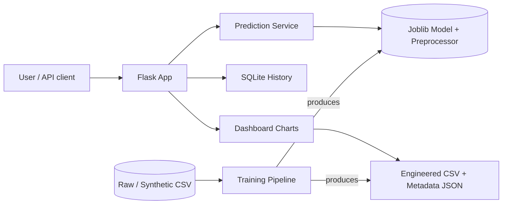

# FloodLens

<div align="center">


**AI-Based Flood Risk Prediction and Early Warning System**
</div>

## Project Overview

FloodLens is an end-to-end data-science project that estimates flood risk
for a selected location using environmental, hydrological and historical
features. It classifies risk into four ordinal levels — **Low · Moderate ·
High · Critical** — and explains the factors driving each prediction.
It ships with a Flask web UI, a JSON API, an interactive dashboard, a
prediction-history store (SQLite), and a complete training pipeline.

> ⚠ **Ethical disclaimer.** FloodLens is an educational, research-oriented
> ML decision-support system. It is **not** an official emergency warning
> and must not be used as a substitute for government weather, flood,
> evacuation or disaster-management authorities.

## Problem Statement

Flooding is among the world's most destructive natural hazards. Early
intelligence about elevated flood risk can help communities, first
responders, and planners prepare — but reliable early warning requires
combining multiple environmental signals, not a single rainfall threshold.
FloodLens demonstrates how multi-factor ML can act as a transparent,
explainable decision-support aid.

## Motivation

- Build a **complete, deployable** data-science project suitable for a
  final-year college portfolio.
- Demonstrate the full pipeline: data → cleaning → EDA → feature engineering
  → model comparison → tuning → explainability → deployment.
- Keep the stack lightweight (Python + Flask + SQLite + scikit-learn) so it
  runs on free hosting.
- Be honest about data and limitations: use a real CC0 dataset by default;
  generate clearly-labelled synthetic data when the real dataset is absent.

## Objectives

1. Predict flood risk as a 4-class problem (Low / Moderate / High / Critical).
2. Use **meaningful features** (rainfall, discharge, water level, elevation,
   soil, land cover, infrastructure, historical floods).
3. Compare multiple ML algorithms and tune the best.
4. Provide **per-prediction explanations** without heavy dependencies.
5. Expose a production-shaped JSON API and a polished UI.
6. Persist prediction history in SQLite.
7. Cover core logic with automated tests.
8. Ship deployment-ready files for free hosting.

## Key Features

- 🌧️ Multi-factor risk prediction (not just a rainfall threshold)
- 📊 Trained and tuned Logistic Regression, Decision Tree, Random Forest,
  Gradient Boosting (XGBoost optional)
- 🧠 Lightweight feature-contribution explanations
- 📈 Interactive Plotly dashboard (distributions, correlation heatmap,
  feature importance, confusion matrix, model comparison)
- 🗂️ SQLite prediction history with clear/export capability
- 🚀 JSON API (`/api/predict`, `/api/health`, `/api/metadata`)
- ✅ Input validation, CSRF protection, error handling
- 🧪 Test suite (16 tests) using pytest
- 🐇 Lightweight: model is loaded once, not retrained per request

## System Architecture



## Workflow

```
Data → Cleaning → Feature Engineering → Model Training & Tuning
  → Model Selection → Explainability → Flask UI + JSON API
```

## Dataset

### Dataset Source

**Preferred:** *Flood Risk in India* (Kaggle, CC0 Public Domain) by s3programmer/WARNER.

- URL: https://www.kaggle.com/datasets/s3programmer/flood-risk-in-india
- License: **CC0 Public Domain** (free to use, no restrictions).
- Rows: ~50,000 synthetic-ish tabular records across Indian locations with
  meteorological, hydrological, geographical and socio-economic features.
- Coverage: India.

If the real dataset is not present in `data/raw/`, the training pipeline
automatically generates a **synthetic dataset** of the same schema, clearly
labelled in the UI and metadata as synthetic. The synthetic fallback exists
only so that the pipeline and app are demonstrable offline — do not
interpret model performance on synthetic data as evidence about the real
world.

### Dataset License

- Project **code**: MIT (see `LICENSE`)
- **Real dataset**: CC0 Public Domain
- **Synthetic dataset**: generated by this project; same terms as the code
  but MUST be labelled synthetic everywhere it is used.

### Data Dictionary

| Column                   | Type   | Description |
|--------------------------|--------|-------------|
| Latitude                 | float  | Latitude of observation point |
| Longitude                | float  | Longitude of observation point |
| Rainfall_mm              | float  | Rainfall (mm) |
| Temperature_C            | float  | Temperature (°C) |
| Humidity_pct             | float  | Relative humidity (%) |
| River_Discharge_m3_s     | float  | River discharge (m³/s) |
| Water_Level_m            | float  | River water level (m) |
| Elevation_m              | float  | Elevation above sea level (m) |
| Land_Cover               | cat    | Urban / Forest / Agricultural / Water Body / Desert |
| Soil_Type                | cat    | Sandy / Clay / Loam / Silt / Peat |
| Population_Density       | float  | Persons per km² |
| Infrastructure           | 0/1    | Flood-control infrastructure present? |
| Historical_Floods        | 0/1    | Has the location flooded historically? |
| Flood_Occurred           | 0/1    | Binary flood-event label |

## Data Preprocessing

- Column-name normalization and type coercion.
- Duplicate removal.
- Physically plausible clipping of numeric outliers (e.g., rainfall 0–2000 mm).
- Median imputation for numeric features, mode for categorical features.
- Categorical label canonicalization (`urban` → `Urban`, etc.).

## Exploratory Data Analysis

Automated EDA is produced in two forms:

1. **Interactive Plotly charts** on the `/dashboard` page (risk
   distribution, rainfall box plots, correlation heatmap, scatter of
   discharge vs water level, feature importances, confusion matrix, model
   comparison bar chart).
2. **Static PNG exports** under `app/static/exports/` (used as fallbacks
   and for docs/screenshots).

## Feature Engineering

Engineered features (see `src/feature_engineering.py`):

| Feature                 | Meaning |
|-------------------------|---------|
| `Rainfall_72h_proxy`    | √Rainfall · 4.5 as a proxy for antecedent wetness |
| `Rainfall_x_Level`      | Rainfall × water-level interaction |
| `Discharge_x_Humidity`  | River-discharge × humidity interaction |
| `Elevation_inv`         | 1/(elevation+10) — low-elevation risk proxy |

## Target Variable (Risk Level)

The dataset ships with a binary `Flood_Occurred` label. We derive a
4-class ordinal risk level:

- A continuous **Risk Score (0–1)** is computed as a weighted sum of
  percentiles of rainfall, water level, river discharge, humidity, inverse
  elevation, plus penalties for soil drainage and land cover, a mitigation
  term for infrastructure, and a historical-flood term.
- The score is binned into Low (<0.30), Moderate (0.30–0.50), High (0.50–0.75),
  Critical (≥0.75).
- Every row with `Flood_Occurred=1` is promoted to at least **High**, and
  to **Critical** when the risk score ≥ 0.60.

This is a **hazard indicator**, not a ground-truth severity label; see
Limitations.

## Machine Learning Models

The pipeline trains and compares:

1. **Logistic Regression** (balanced class weights)
2. **Decision Tree** (balanced class weights)
3. **Random Forest** (200 estimators)
4. **Gradient Boosting** (150 estimators)
5. **XGBoost** (if installed)

All models are wrapped in a scikit-learn `Pipeline` with:

- Median imputation + standard scaling for numeric features
- One-hot encoding for categorical features
- Mode imputation for binary features

The pipeline prevents data leakage because the preprocessor is fit only
on the training fold.

## Model Comparison

**Validation set** (synthetic fallback data, 50k rows split 70/15/15):

| Model              | Accuracy | F1 (macro) | Recall (macro) |
|--------------------|----------|------------|----------------|
| Logistic Regression| 0.7463   | **0.7706** | **0.8004**     |
| Decision Tree      | 0.6304   | 0.6459     | 0.6393         |
| Random Forest      | 0.7197   | 0.7365     | 0.7315         |
| Gradient Boosting  | 0.7098   | 0.7264     | 0.7154         |

## Hyperparameter Tuning

The best-performing model (Logistic Regression) is tuned with
`RandomizedSearchCV` over regularization strength `C ∈ {0.1, 1.0, 10.0}`
using **3-fold stratified CV** with macro-F1 as the scoring metric.

- Best `C`: **1.0**
- Best CV F1 (macro): **0.7727**

## Final Model

**Selected model: Logistic Regression (balanced class weights)**.

It was selected because it obtained the best validation **macro-F1** and
**recall**, the two metrics we care about most for a risk system — missing
high-risk events is worse than occasional false alarms. Logistic
Regression is also lightweight, fast at inference, and interpretable via
linear coefficients, which aligns with our deployment-weight goals.

### Evaluation Metrics (held-out test set)

| Metric            | Value  |
|-------------------|--------|
| Accuracy          | 0.7568 |
| Precision (macro) | 0.7590 |
| Recall (macro)    | **0.8113** |
| F1 (macro)        | **0.7786** |
| F1 (weighted)     | 0.7518 |

> These numbers are measured on the **synthetic fallback dataset** because
> the real CC0 CSV is not bundled in the repo. Drop the real CSV into
> `data/raw/flood_risk_india.csv` and rerun training to see real-data metrics.

## Explainable AI

For each prediction the UI and API return:

- Predicted risk level + confidence (max class probability)
- Per-class probabilities
- Top contributing features with magnitude labels (Minor / Notable / Significant / Major)
- Plain-English interpretation and precautions

The lightweight explainer computes z-scores for numeric features relative
to the training distribution (with directional awareness — e.g. high
elevation reduces risk) and compares categorical levels to their average
risk. It is deliberately transparent and dependency-light; we explicitly
label contributions as "influencing the model's prediction", not as
proven causes of flooding.

## Web Application

Routes:

| Route          | Purpose |
|----------------|---------|
| `/`            | Home / landing |
| `/predict`     | Prediction form + results |
| `/dashboard`   | Interactive model dashboard |
| `/history`     | SQLite-stored prediction history |
| `/methodology` | Pipeline & methodology writeup |
| `/api`         | API documentation with live demo buttons |
| `/about`       | About, limitations, ethics, future scope |

## API Documentation

### `GET /api/health`

Liveness probe. Returns `{"status": "ok", "service": "FloodLens", ...}`.

### `POST /api/predict`

Accepts JSON with the model features. Returns:

```json
{
  "ok": true,
  "risk_level": "High",
  "confidence": 0.82,
  "probabilities": {"Low": 0.04, "Moderate": 0.14, "High": 0.62, "Critical": 0.20},
  "important_factors": [ ... ],
  "model_version": "1.0.0"
}
```

Invalid inputs return HTTP 400 with a list of `errors`.

### `GET /api/metadata`

Returns model version, name, test metrics, dataset summary and feature list.

## Installation

Requires Python 3.11+ (3.10 should work too).

```bash
git clone https://github.com/<your-username>/FloodLens.git
cd FloodLens
python3 -m venv .venv
source .venv/bin/activate          # Windows: .venv\Scripts\activate
pip install -r requirements.txt
```

## Local Setup

```bash
# 1. (Optional) drop the real dataset into data/raw/flood_risk_india.csv
#    (see data/README.md for the download link)

# 2. Train the model (uses real data if present, else synthetic fallback)
python scripts/train_pipeline.py            # auto-detect
python scripts/train_pipeline.py --synthetic  # force synthetic

# 3. Run the Flask app
python run.py
# Open http://127.0.0.1:5000
```

The first time you run, if no model exists the `/predict` page will show a
helpful message with the training command.

## Running the Application

- Local dev: `python run.py` (binds to `0.0.0.0:5000` by default)
- Production: `gunicorn wsgi:application --bind 0.0.0.0:$PORT --workers 2 --timeout 120`

## Testing

```bash
pytest
```

Current test suite: **16 tests, all passing** (data processing, feature
engineering, model loading, prediction, validation, API endpoints, pages).

## Deployment

FloodLens is prepared for free deployment on **Render** (and should also
work on Railway, Fly.io, Hugging Face Spaces with a Flask SDK, or any
Python-capable PaaS). Render's free tier supports Python build +
`gunicorn`, with cold starts on free plans.

### Deploy to Render (free)

1. Push the repo to GitHub.
2. Create a Render account and click **New → Web Service**.
3. Connect the FloodLens repo.
4. Configure:
   - **Build command:** `pip install -r requirements.txt && python scripts/train_pipeline.py --synthetic`
   - **Start command:** `gunicorn wsgi:application --bind 0.0.0.0:$PORT --workers 2 --timeout 120`
5. Add environment variables:
   - `FLASK_ENV=production`
   - `FLASK_DEBUG=0`
   - `SECRET_KEY` = any long random string (Render can generate one)
6. Click **Deploy**. Wait ~5–10 minutes (install + training).
7. Verify:
   - `https://<your-app>.onrender.com/health` returns `{"status":"ok", ...}`.
   - `POST /api/predict` returns valid JSON.
   - The homepage, predict page and dashboard all render.

> ⚠ Free-tier notes: Render free services **sleep after inactivity** and
> cold-start on the next request. The SQLite database is **ephemeral** on
> free-tier (it lives on the instance disk, which can be rebuilt); treat
> prediction history as non-persistent on free hosting.

A pre-built `render.yaml` and `Procfile` are provided in the repo.

## GitHub Usage

```bash
git add .
git commit -m "Initial FloodLens release"
git branch -M main
git remote add origin https://github.com/<you>/FloodLens.git
git push -u origin main
```

## Screenshots

See `app/static/exports/` for auto-generated EDA PNGs (risk distribution,
correlation heatmap, feature importance, confusion matrix). Add UI
screenshots to `screenshots/` as you see fit.

## Limitations

- **Geography:** Training data (real or synthetic) is India-oriented; do not
  assume global generalizability.
- **Temporal:** No time-series modelling is performed; the cumulative
  rainfall feature is a proxy.
- **Target derivation:** The 4-class target is constructed from a continuous
  risk score plus the binary flood label; it is a hazard indicator, not a
  ground-truth severity measurement.
- **Synthetic mode:** When using synthetic data, numbers demonstrate the
  pipeline, not real-world skill.
- **Class imbalance:** Imbalance is mitigated by balanced class weights and
  macro-F1, but recall for Critical is not perfect.
- **False negatives** are dangerous — cross-check high-risk conditions
  against official warnings.
- **Distribution shift** (climate change, land use) will degrade performance
  over time; no monitoring/retraining loop exists in the prototype.

## Ethical Considerations

- FloodLens is a **decision-support aid**, not an emergency warning service.
- It must never be used to ignore or override government-issued guidance.
- No personal data is collected; prediction history stores only anonymous
  input summaries and timestamps.
- The model is probabilistic — false positives and false negatives are
  expected; recall is prioritized for high-risk classes but is not 100%.

## Future Scope

- Real-time ingestion from public weather APIs (Open-Meteo, IMD, NOAA).
- Spatiotemporal models (LSTM, Temporal Fusion Transformers).
- GIS integration with Leaflet + OpenStreetMap.
- IoT water-level sensor integration.
- Continuous monitoring and retraining pipelines.
- Multi-region training for broader geographic coverage.
- Multi-channel alerting (email/SMS/mobile).
- Dockerization for production.

## Conclusion

FloodLens demonstrates a complete, honest, and runnable data-science
project — from documented dataset and reproducible pipeline through to a
deployed, tested web application with an API and explainable
predictions. It is suitable as a college capstone, portfolio piece, or
starting point for further research into operational flood-risk modelling.

## References

1. Flood Risk in India dataset (CC0). Kaggle. https://www.kaggle.com/datasets/s3programmer/flood-risk-in-india
2. Pedregosa, F. et al. (2011). *Scikit-learn: Machine Learning in Python.* JMLR 12, pp. 2825–2830.
3. Lundberg, S. M., & Lee, S.-I. (2017). *A Unified Approach to Interpreting Model Predictions.* NeurIPS.
4. Global Flood Awareness System (GloFAS) / Open-Meteo Flood API. https://open-meteo.com/en/docs/flood-api
5. Flask documentation. https://flask.palletsprojects.com/
